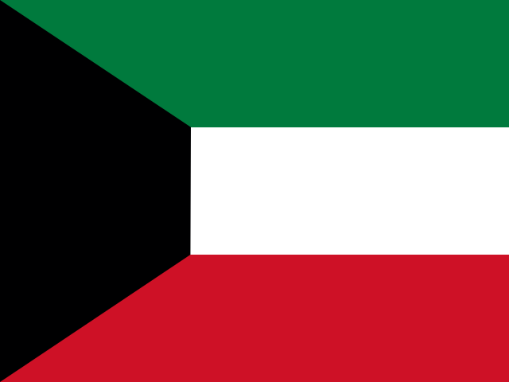
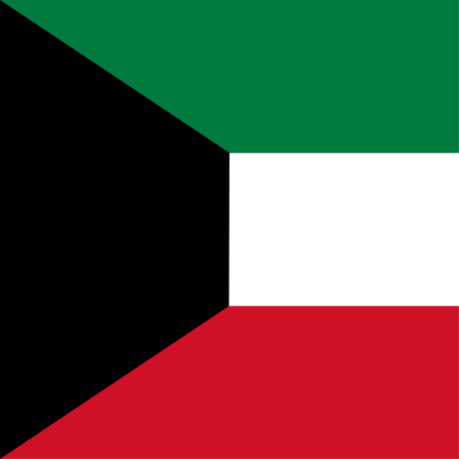

# country-flag-kit


Country flags **plus lightweight country data** — clean SVGs in **4:3 and 1:1**, with each
country's **flag emoji** and **dial (calling) code**, in an ISO-3166 manifest. Built for
phone-number country pickers, locale selectors, and dropdowns.

- **271 flags**, named by lowercase ISO 3166-1 alpha-2 code (`kw`, `us`, `sa`, …).
- Based on [flag-icons](https://github.com/lipis/flag-icons) — hand-drawn natively at each
  ratio, so emblems are **never stretched or distorted**.
- `index.json` also carries **`emoji`** and **`dial_code`** for every country.

## Install

```bash
npm install country-flag-kit
# or
git clone https://github.com/JasGH/country-flag-kit.git
```

## Usage

```html
<!-- rectangular 4:3 -->

<!-- square 1:1 -->

```

Build a phone-input country list from the manifest:

```js
import flags from "country-flag-kit";   // index.json

flags
  .filter(f => f.iso && f.dial_code)
  .forEach(c => {
    // 🇰🇼  Kuwait  +965
    addOption(c.code, `${c.emoji} ${c.name} ${c.dial_code}`,
              `4x3/${c.code.toLowerCase()}.svg`);
  });
```

### Data — `index.json`

```json
{ "code":"KW", "name":"Kuwait", "emoji":"🇰🇼", "dial_code":"+965",
  "continent":"Asia", "iso":true,
  "file_4x3":"4x3/kw.svg", "file_1x1":"1x1/kw.svg" }
```

| field | notes |
|-------|-------|
| `emoji` | flag emoji — `null` for org/region codes without a standard emoji |
| `dial_code` | international calling code — `null` for Antarctica / Heard Is. and non-countries |
| `iso` | `true` for real ISO 3166-1 entries (filter out EU, UN, …) |
| `file_4x3` / `file_1x1` | SVG paths for each ratio |

Round flags: in 1:1, add `border-radius:50%` in your CSS.

## Demo

Open `index.html` for an interactive gallery — search by name/code/dial, **4:3 ⇄ 1:1 toggle**,
click-to-copy. Publish free via **GitHub Pages** (Settings → Pages → deploy from branch).

## Structure

```
.
├── 4x3/            271 rectangular SVGs (4:3)
├── 1x1/            271 square SVGs (1:1)
├── index.json      ISO-3166 manifest (name, emoji, dial_code, …)
├── index.html      interactive gallery / demo
├── package.json    npm metadata
├── CHANGELOG.md
└── LICENSE         MIT (code) + flag-icons attribution
```

## Colors

Flags keep flag-icons' undistorted shapes, with colors corrected to official specification (122 flags — e.g. Kuwait's official green `#007a3d`, not flag-icons' brighter default). **Marshall
Islands** is recolored to its official deep blue (`#003087`) and orange (`#E57200`).

## License

MIT — see `LICENSE`. Flag artwork is from flag-icons (MIT, © 2013 Panayiotis Lipiridis).


---

Repo: https://github.com/JasGH/country-flag-kit — `npm publish` when ready (`country-flag-kit` is free on npm).
